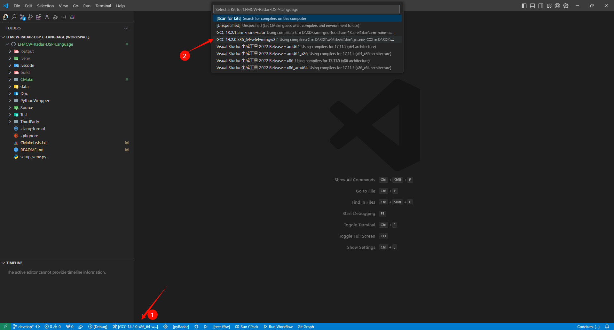
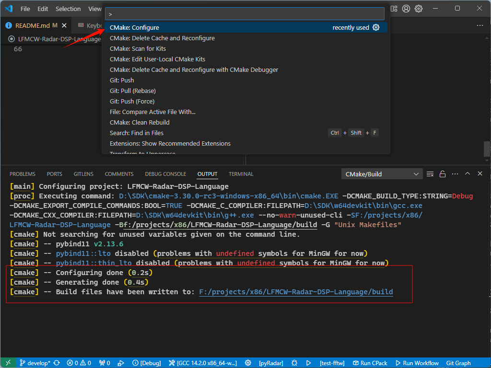
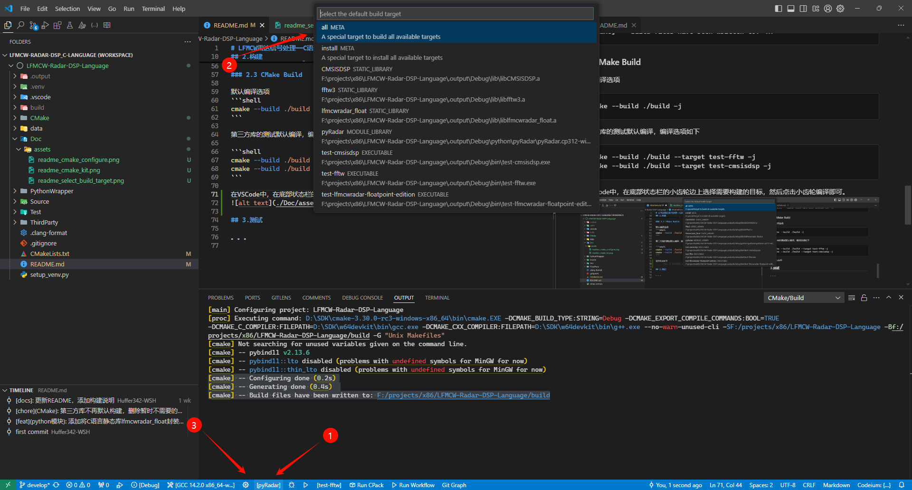
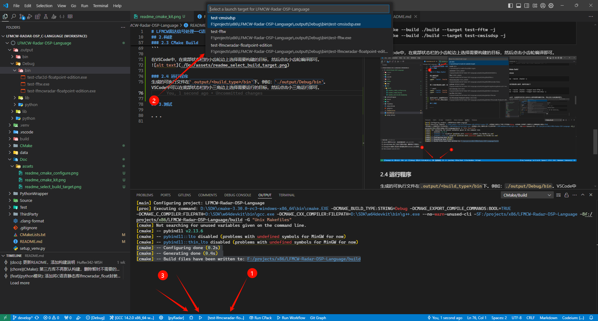

# 构建与使用

仅仅编译出静态库并在其他项目中使用，则只需要C/C++语言工具链；完成的测试需要使用Python。

## 完整构建工程


### 准备工具链

- Python： 用来创建venv，以及给Python包构建提供依赖
- C语言编译器
  + windwos： 官方推荐MSVC，实测w64devkit提供的mingw64-gcc也可以编译模块。下载路径：[w64devkit](https://github.com/skeeto/w64devkit/releases/download/v2.0.0/w64devkit-x64-2.0.0.exe)
  + Linux: GCC， 使用的glibc版本需要低于和python环境中使用的glibc，否则会报错。
  > MSVC不支持可变长度数组
- CMake, 下载路径: [主页](https://cmake.org/download/)、[windows版本](https://github.com/Kitware/CMake/releases/download/v3.31.0-rc2/cmake-3.31.0-rc2-windows-x86_64.msi)

安装好后将主程序的所在文件夹添加到PATH环境变量中

### 创建python虚拟环境

```shell
python setup_venv.py
```

我使用的是python3.12.7。因为该项目会构建Python模块并安装，所以推荐创建虚拟环境，避免污染全局环境。


### CMake配置工程

#### 准备配置文件

准备一个`RadarConfig.h`文件用于配置雷达算法，使用CMake变量`RADAR_CONFIG_FILE_DIRECTORY`指定文件所在路径，该变量作用于`Source/fixed_point/CMakeLists.txt`

#### 使用CMake配置工程

假如在命令行中，运行
```shell
cmake -S . -B build
```
假如CMake默认选择了MSVC，就需要手动指定生成器和编译器:
```shell
cmake -S . -B ./build -G "MinGW Makefiles" -DCMAKE_C_COMPILER=gcc -DCMAKE_CXX_COMPILER=g++
```

假如是在VSCode中，双击`.vscode/LFMCW-Radar-DSP_C-Language.code-workspace`打开工作区
- 安装拓展`ms-vscode.cmake-tools`
- 底部状态栏选择工具链
  
- `ctrl+shift+p`打开命令面板，输入`CMake: Configure`，按回车运行
  

无论是命运行还是VSCode，配置完成后，会输出类似下面的文本
```
[cmake] -- Configuring done (0.2s)
[cmake] -- Generating done (0.4s)
[cmake] -- Build files have been written to: ...
```

### 构建工程

默认编译选项
```shell
cmake --build ./build -j
```

第三方库的测试默认编译，编译选项如下

```shell
cmake --build ./build --target test-fftw -j
cmake --build ./build --target test-cmsisdsp -j
```

在VSCode中，在底部状态栏的小齿轮边上选择需要构建的目标，然后点击小齿轮编译即可。



### 2.4 运行测试

生成的可执行文件在`.output/<build_type>/bin`下。例如：`./output/Debug/bin`。VSCode中可以在底部状态栏的小三角边上选择需要运行的目标，然后点击小三角运行即可。



## 为单片机构建静态库

### 安装工具链

不需要安装Python，其余同上

### 配置交叉编译

`CMake/toolchain-armclang.cmake`文件提供了一个给Cortex-M0设备配置ARMClang工具链(Keil中的AC6)的例子，在CMake Configure时添加参数`-DCMAKE_TOOLCHAIN_FILE=CMake/toolchain-armclang.cmake`即可设置交叉编译。


如何使用的是VSCode，可以将参数添加到`.vscode/LFMCW-Radar-DSP_C-Language.code-workspace`文件中的`"settings"`下的`"cmake.configureArgs"`来启用交叉编译

```json
    "settings": {
        "cmake.configureArgs": [
            "-DCMAKE_TOOLCHAIN_FILE=CMake/toolchain-armclang.cmake"
        ],
  }
```

需要注意的是`CMake/toolchain-armclang.cmake`中设置了`set(CROSS_COMPILE ON)`，该参数使得根目录的CMakeLists.txt中指挥配置算法库的源代码而不过包括PythonWrapper和tests。

编译会得到静态库`liblfmcwradar_fixed`，在需要使用雷达算法的项目中添加该静态库以及`Source/fixed_point/Include`下的头文件即可使用。
