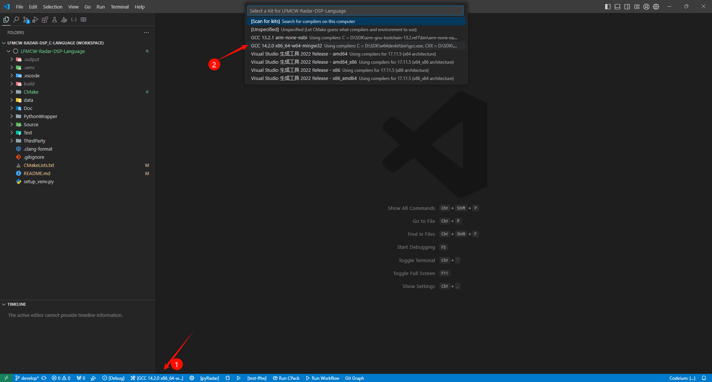
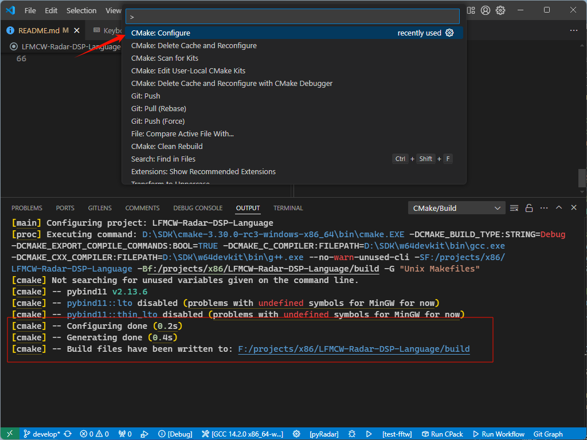
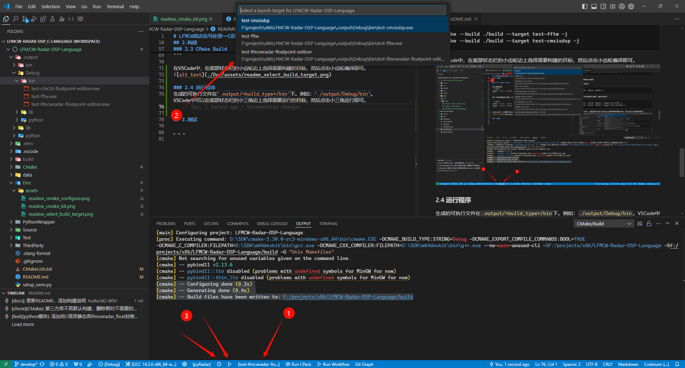

# LFMCW雷达信号处理——C语言实现

## 1.简介

该项目旨在使用C语言实现一个可移植的适用于LFMCW雷达的目标检测程序，包含信号处理和目标跟踪等功能。

一些比较消耗性能的功能比如`开方`、`三角函数`、`FFT`，需要通过宏来配置。


文件结构：
```
├──.output         # 生成的可执行文件和库文件
├──.venv           # Python虚拟环境
├──.vscode         # VSCode配置
├──Data            # 测试数据
├──Doc             # 文档
├──PythonWrapper   # C语言静态库封装成Python模块
├──Source          # C语言源码
│  ├──fixed_point  # 定点数版本，当前继续该版本用于Cortex-M0平台
│  └──float_point  # 浮点数版本
├──Test            # 测试程序，测试部分函数以及静态库
└──ThirdParty      # 第三方库，主要为测试准备
```

程序主体的源文件文件位于`Source`文件夹中。包含定点数版本和浮点数版本，编译后得到静态库。

### Python wrapper

`PythonWrapper`文件夹下的内容将编译好的C语言静态库再次封装成Python模块，以便在Python中测试编写好的C语言算法，更方便实现数据的输入以及输出数据的可视化和验证。


## 2.构建

编译出的文件位于项目根目录下的`.output`文件夹中
```
.output
 └───<build_type> # 例如：Debug、Release
     ├───bin      # 可执行文件
     ├───lib      # 库
     └───python   # python模块
```

构建好的python包还会被安装到`.venv/Lib/site-packages/pylfmcwradar`目录中，在项目根目录下的Python虚拟环境中可直接导入模块。

### 2.0 下载工程并准备工具

- Python： 用来创建venv，以及给Python包构建提供依赖
- C语言编译器
  + windwos： 官方推荐MSVC，实测w64devkit提供的mingw64-gcc也可以编译模块。下载路径：[w64devkit](https://github.com/skeeto/w64devkit/releases/download/v2.0.0/w64devkit-x64-2.0.0.exe)
  + Linux: GCC
  > MSVC不支持可变长度数组
- CMake, 下载路径: [主页](https://cmake.org/download/)、[windows版本](https://github.com/Kitware/CMake/releases/download/v3.31.0-rc2/cmake-3.31.0-rc2-windows-x86_64.msi)

安装好后将主程序的所在文件夹添加到PATH环境变量中

### 2.1 创建python虚拟环境

```shell
python setup_venv.py
```

我使用的是python3.12.7。因为该项目会构建Python模块并安装，所以推荐创建虚拟环境，避免污染全局环境。


### 2.2 CMake Configure

```shell
cmake -S . -B build
```
假如CMake默认选择了MSVC，就需要手动指定生成器和编译器:
```shell
cmake -S . -B ./build -G "MinGW Makefiles" -DCMAKE_C_COMPILER=gcc -DCMAKE_CXX_COMPILER=g++
```

假如是在VSCode中，双击`.vscode/LFMCW-Radar-DSP_C-Language.code-workspace`打开工作区
- 安装拓展`ms-vscode.cmake-tools`
- 底部状态栏选择工具链
  
- `ctrl+shift+p`打开命令面板，输入`CMake: Configure`，按回车运行
  

无论是命运行还是VSCode，配置完成后，会输出类似下面的文本
```
[cmake] -- Configuring done (0.2s)
[cmake] -- Generating done (0.4s)
[cmake] -- Build files have been written to: ...
```

### 2.3 CMake Build

默认编译选项
```shell
cmake --build ./build -j
```

第三方库的测试默认编译，编译选项如下

```shell
cmake --build ./build --target test-fftw -j
cmake --build ./build --target test-cmsisdsp -j
```

在VSCode中，在底部状态栏的小齿轮边上选择需要构建的目标，然后点击小齿轮编译即可。


### 2.4 运行程序
生成的可执行文件在`.output/<build_type>/bin`下。例如：`./output/Debug/bin`。VSCode中可以在底部状态栏的小三角边上选择需要运行的目标，然后点击小三角运行即可。


## 3. 使用Python验证算法

激活工程中的虚拟环境后，使用以下代码导入模块

```python
from pylfmcwradar import pyradar_float
```

算法还在开发阶段，模块具体的使用方法请阅读C语言代码以及`PythonWrapper`文件夹下的模块封装代码。

。。。
