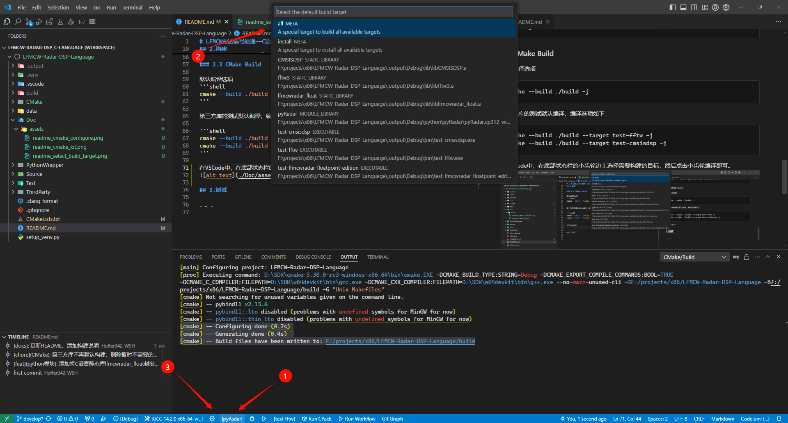

# LFMCW雷达信号处理——C语言实现

## 1.简介

该项目旨在使用C语言实现一个可移植的适用于LFMCW雷达的目标检测程序，包含信号处理和目标跟踪等功能。

一些比较消耗性能的功能比如`开方`、`三角函数`、`FFT`，需要通过宏以及内联函数来配置。


**文件结构**：
```
├──.output                  # 生成的可执行文件和库文件
├──.venv                    # Python虚拟环境
├──.vscode                  # VSCode配置
├──Data                     # 测试数据
├──Doc                      # 文档
├──PythonWrapper            # C语言静态库封装成Python模块
│   └── pylfmcwradar_pkg    # Python模块源代码
│       ├── include         # 公共头文件，提供封装数据结构用的模板
│       ├── pyradar_fixed   # 定点数版本封装源代码
│       └── pyradar_float   # 浮点数版本模块源代码
├──Source                   # C语言源码
│  ├──fixed_point           # 定点数版本，当前继续该版本用于Cortex-M0平台
│  └──float_point           # 浮点数版本
├──Test                     # 测试程序，测试部分函数以及静态库
│   ├── CMSIS-DSP
│   ├── FFTW
│   ├── Python              # Python模块测试
│   └── Radar_Fixed         # 雷达算法库点数版本的C语言测试
└──ThirdParty    # 第三方库
    ├── CMSIS-DSP           # 适合ARM的DSP函数
    ├── FFTW                # 提供浮点数FFT
    ├── googletest-1.15.2   # C++测试框架
    └── pybind11-2.13.6     # 封装C语言代码成Python模块
```
---

雷达算法的源代码文件位于`Source`文件夹中。包含定点数版本和浮点数版本，编译后得到静态库。

---

### Python wrapper

`PythonWrapper`文件夹下的内容将编译好的C语言静态库再次封装成Python模块，以便在Python中测试编写好的C语言算法，更方便实现数据的输入以及输出数据的可视化和验证。


## 2.构建

编译出的文件位于项目根目录下的`.output`文件夹中
```
.output
 └───<build_type> # 例如：Debug、Release
     ├───bin      # 可执行文件
     ├───lib      # 库
     └───python   # python模块
```

构建好的python包还会被安装到`.venv/.../site-packages/pylfmcwradar`目录中，在项目根目录下的Python虚拟环境中可直接导入模块。

### 2.0 下载工程并准备工具

- Python： 用来创建venv，以及给Python包构建提供依赖
- C语言编译器
  + windwos： 官方推荐MSVC，实测w64devkit提供的mingw64-gcc也可以编译模块。下载路径：[w64devkit](https://github.com/skeeto/w64devkit/releases/download/v2.0.0/w64devkit-x64-2.0.0.exe)
  + Linux: GCC， 使用的glibc版本需要低于和python环境中使用的glibc，否则会报错。
  > MSVC不支持可变长度数组
- CMake, 下载路径: [主页](https://cmake.org/download/)、[windows版本](https://github.com/Kitware/CMake/releases/download/v3.31.0-rc2/cmake-3.31.0-rc2-windows-x86_64.msi)

安装好后将主程序的所在文件夹添加到PATH环境变量中

### 2.1 创建python虚拟环境

```shell
python setup_venv.py
```

我使用的是python3.12.7。因为该项目会构建Python模块并安装，所以推荐创建虚拟环境，避免污染全局环境。


### 2.2 CMake Configure

---
**可配置参数于文件**

- **RADAR_CONFIG_FILE_DIRECTORY**：该变量指定`RadarConfig.h`文件所在路径。`RadarConfig.h`头文件用于配置雷达算法。该变量作用于`Source/fixed_point/CMakeLists.txt`


- `CMake/configTest.cmake` 内涵多个`option()`，用于配置是否编译测试案例


---


```shell
cmake -S . -B build
```
假如CMake默认选择了MSVC，就需要手动指定生成器和编译器:
```shell
cmake -S . -B ./build -G "MinGW Makefiles" -DCMAKE_C_COMPILER=gcc -DCMAKE_CXX_COMPILER=g++
```

假如是在VSCode中，双击`.vscode/LFMCW-Radar-DSP_C-Language.code-workspace`打开工作区
- 安装拓展`ms-vscode.cmake-tools`
- 底部状态栏选择工具链
  
- `ctrl+shift+p`打开命令面板，输入`CMake: Configure`，按回车运行
  

无论是命运行还是VSCode，配置完成后，会输出类似下面的文本
```
[cmake] -- Configuring done (0.2s)
[cmake] -- Generating done (0.4s)
[cmake] -- Build files have been written to: ...
```

### 2.3 CMake Build

默认编译选项
```shell
cmake --build ./build -j
```

第三方库的测试默认编译，编译选项如下

```shell
cmake --build ./build --target test-fftw -j
cmake --build ./build --target test-cmsisdsp -j
```

在VSCode中，在底部状态栏的小齿轮边上选择需要构建的目标，然后点击小齿轮编译即可。


### 2.4 运行程序
生成的可执行文件在`.output/<build_type>/bin`下。例如：`./output/Debug/bin`。VSCode中可以在底部状态栏的小三角边上选择需要运行的目标，然后点击小三角运行即可。


## 3. 开发指南

### 3.1 新建功能分支

git pull最新的develop分支，然后新建并签出分支，分支命名格式为 `feature/<功能>` ，如 `feature/cfar2d-fixed-point-edition`


### 3.2 开发新功能
开发一个功能函数的流程如下
1. 编写C语言源码
2. 使用C/C++编写单元测试，测试C语言函数
3. 将新编写的C语言函数封装成Python模块中的函数，一些复杂的功能可以跳过这一步，使用Python测试
4. 在`Test/Python/<edition>/test_<file>.py`中添加测试，测试模块封装以及函数功能
5. 将新功能添加到`Test/Python/<edition>/test_main.py`中，测试完整的雷达算法流程

### 3.3 合并分支

1. 拉取最新的develop分支 `git pull --rebase` 
2. 将功能分支变基到最新的develop分支上，可能需要解决冲突 
   ```shell
   git rebase develop
   ```
3. 将功能分支合并到develop分支，因为上一步执行了变基操作，所以这次合并不会新建一个`合并提交`。
   ```shell
   git checkout develop
   git merge <feature>
   ```


## 4. 使用Python验证算法

激活工程中的虚拟环境后，使用以下代码导入模块

```python
from pylfmcwradar import pyradar_fixed
```

算法还在开发阶段，模块具体的使用方法请阅读C语言代码以及`PythonWrapper`文件夹下的模块封装代码。

...


## 5. 在嵌入式项目中应用该算法

### 添加源码

可以选择直接将所需的版本复制到嵌入式项目中，比如将定点数版本`Source/fixed_point`复制到根目录下的`ThirdParty/lfmcwradar_fixed`文件夹

然后使用移植该工程默认使用的第三方库
- [STC - Smart Template Containers](https://github.com/stclib/STC)
- [CMSIS-DSP](https://github.com/ARM-software/CMSIS-DSP)

假如使用的是CMake，就使用`add_subdirectory(ThirdParty/lfmcwradar_fixed)`添加目录，然后使用`target_link_libraries()`添加`lfmcwradar_fixed`即可

假如使用的是Keil，添加`Source`目录下的所有源文件，并将`Include`添加到`Option >> C/C++ >> Include Paths`中


### 单独编译静态库


`CMake/toolchain-armclang.cmake`文件提供了一个给Cortex-M0设备配置ARMClang工具链(Keil中的AC6)的例子，在CMake Configure时添加参数`-DCMAKE_TOOLCHAIN_FILE=CMake/toolchain-armclang.cmake`即可设置交叉编译。


如何使用的是VSCode，可以将参数添加到`.vscode/LFMCW-Radar-DSP_C-Language.code-workspace`文件中的`"settings"`下的`"cmake.configureArgs"`来启用交叉编译

```json
	"settings": {
		"cmake.configureArgs": [
			"-DCMAKE_TOOLCHAIN_FILE=CMake/toolchain-armclang.cmake"
		],
  }
```

需要注意的是`CMake/toolchain-armclang.cmake`中设置了`set(CROSS_COMPILE ON)`，该参数使得根目录的CMakeLists.txt中指挥配置算法库的源代码而不过包括PythonWrapper和tests。

编译会得到静态库`liblfmcwradar_fixed`，在需要使用雷达算法的项目中添加该静态库以及`Source/fixed_point/Include`下的头文件即可使用。
